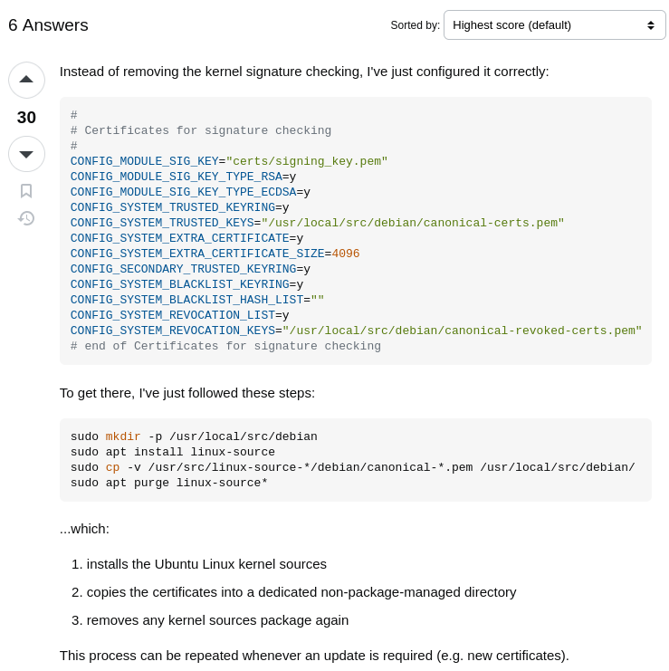

# PET_implementation

<!-- *** -->

* create VM for ubuntu desktop 20.4
* After the os is runnning in the vm check the kernel version using -> 
    ```*uname -r*``` output ```5.15.0-126-generic```
* then run \
```wget https://cdn.kernel.org/pub/linux/kernel/v5.x/linux-5.15.tar.xz```
* ```tar -xf linux-5.15.tar.xz```
* ```cd linux-5.15/```
* ```sudo apt update```
* ```sudo apt install gcc-aarch64-linux-gnu binutils-aarch64-linux-gnu```
* ```sudo apt install build-essential libncurses-dev bison flex libssl-dev```
* ```aarch64-linux-gnu-gcc --version```
* ```make ARCH=arm64 CROSS_COMPILE=aarch64-linux-gnu- menuconfig```
* Navigate to Kernel hacking -> Memory Debugging and enable KASAN: runtime memory debugger
* ```make ARCH=arm64 CROSS_COMPILE=aarch64-linux-gnu- -j$(nproc)```
* ```make ARCH=arm64 CROSS_COMPILE=aarch64-linux-gnu- modules```
* ```make ARCH=arm64 CROSS_COMPILE=aarch64-linux-gnu- dtbs```
* ```sudo make ARCH=arm64 CROSS_COMPILE=aarch64-linux-gnu- modules_install```
* ```sudo make ARCH=arm64 CROSS_COMPILE=aarch64-linux-gnu- install```
* ```sudo update-grub```
* ```sudo reboot```


***
#### Check Kernel Configuration
#### ```grep KASAN /boot/config-$(uname -r)```

***
#### [compile-and-install-the-linux-kernel](https://cylab.be/blog/343/compile-and-install-the-linux-kernel)
* create VM for ubuntu desktop 20.4
* After the os is runnning in the vm check the kernel version using -> 
    ```*uname -r*``` output ```5.15.0-126-generic```
* ```sudo apt install  -y build-essential libncurses-dev flex bison libelf-dev libssl-dev```
* ```sudo apt install dwarves```
* ```sudo apt-get install zstd```
* then run \
```wget https://cdn.kernel.org/pub/linux/kernel/v5.x/linux-5.15.tar.xz```
* ```tar -xf linux-5.15.tar.xz```
* ```cd linux-5.15/```
* ```make mrproper```
* ```cp /boot/config-$(uname -r) .config```
* ```make menuconfig```
* Navigate to Kernel hacking -> Memory Debugging and enable KASAN: runtime memory debugger
* ```make -j 3```
* ```sudo make modules_install```
##### Getting error
```ph@ph-Standard-PC-Q35-ICH9-2009:~/linux-5.15$ sudo make modules_install
[sudo] password for ph: 
arch/x86/Makefile:142: CONFIG_X86_X32 enabled but no binutils support
sed: can't read modules.order: No such file or directory
make: *** [Makefile:1501: __modinst_pre] Error 2```
```
* ```sudo apt install binutils-multiarch```
* ```nano .config```
    Search for CONFIG_X86_X32 and set it to n
* ```make -j 5```

***
#### Just installing custom kernel
* ```cd linux-5.15/```
* ```make mrproper```
* ```cp /boot/config-$(uname -r) .config```
* ```vi .config```\
    <!-- Search for CONFIG_X86_X32 and set it to n \ -->
    Try to slip this step if error occurs the try this step :- Search for CONFIG_X86_X32 and set it to n \
    Certificates need to be configured :
    ```
    #
    # Certificates for signature checking
    #
    CONFIG_MODULE_SIG_KEY="certs/signing_key.pem"
    CONFIG_MODULE_SIG_KEY_TYPE_RSA=y
    CONFIG_MODULE_SIG_KEY_TYPE_ECDSA=y
    CONFIG_SYSTEM_TRUSTED_KEYRING=y
    CONFIG_SYSTEM_TRUSTED_KEYS="/usr/local/src/debian/canonical-certs.pem"
    CONFIG_SYSTEM_EXTRA_CERTIFICATE=y
    CONFIG_SYSTEM_EXTRA_CERTIFICATE_SIZE=4096
    CONFIG_SECONDARY_TRUSTED_KEYRING=y
    CONFIG_SYSTEM_BLACKLIST_KEYRING=y
    CONFIG_SYSTEM_BLACKLIST_HASH_LIST=""
    CONFIG_SYSTEM_REVOCATION_LIST=y
    CONFIG_SYSTEM_REVOCATION_KEYS="/usr/local/src/debian/canonical-revoked-certs.pem"
    # end of Certificates for signature checking

    ```

    
    * ```sudo mkdir -p /usr/local/src/debian```
    * ```sudo apt install linux-source```
    * ```sudo cp -v /usr/src/linux-source-*/debian/canonical-*.pem /usr/local/src/debian/```
    * ```sudo apt purge linux-source*```

* ```make menuconfig```
* Make no changes just save the file
* ```make -j 5```
* ```sudo make modules_install -j 5```
##### Getting error
```ph@ph-Standard-PC-Q35-ICH9-2009:~/linux-5.15$ sudo make modules_install
sed: can't read modules.order: No such file or directory
make: *** [Makefile:1501: __modinst_pre] Error 2```
```
##### Getting error
```  LD [M]  drivers/most/most_core.o
  GEN     .version
  CHK     include/generated/compile.h
  LD      vmlinux.o
  MODPOST vmlinux.symvers
  MODINFO modules.builtin.modinfo
  GEN     modules.builtin
BTF: .tmp_vmlinux.btf: pahole (pahole) is not available
Failed to generate BTF for vmlinux
Try to disable CONFIG_DEBUG_INFO_BTF
make: *** [Makefile:1183: vmlinux] Error 1
```

https://stackoverflow.com/questions/67670169/compiling-kernel-gives-error-no-rule-to-make-target-debian-certs-debian-uefi-ce

* ```sudo make install -j 5```
* ```sudo vi /etc/default/grub```
    * chnage to 
    ```
    GRUB_TIMEOUT=5
    GRUB_TIMEOUT_STYLE=menu
    ```
sudo update-grub
sudo reboot


#### Getting Error
```
  CC [M]  crypto/async_tx/async_xor.o
  CC      block/partitions/atari.o
arch/x86/kvm/hyperv.c: In function ‘kvm_hv_flush_tlb’:
arch/x86/kvm/hyperv.c:1856:1: error: the frame size of 1136 bytes is larger than 1024 bytes [-Werror=frame-larger-than=]
 1856 | }
      | ^
  ASN.1   crypto/asymmetric_keys/x509.asn1.[ch]
  ASN.1   crypto/asymmetric_keys/x509_akid.asn1.[ch]
  CC      crypto/asymmetric_keys/x509_public_key.o
arch/x86/kvm/hyperv.c: In function ‘kvm_hv_send_ipi’:
arch/x86/kvm/hyperv.c:1948:1: error: the frame size of 1176 bytes is larger than 1024 bytes [-Werror=frame-larger-than=]
 1948 | }
      | ^
  CC [M]  crypto/async_tx/async_pq.o
  ASN.1   crypto/asymmetric_keys/pkcs7.asn1.[ch]
```